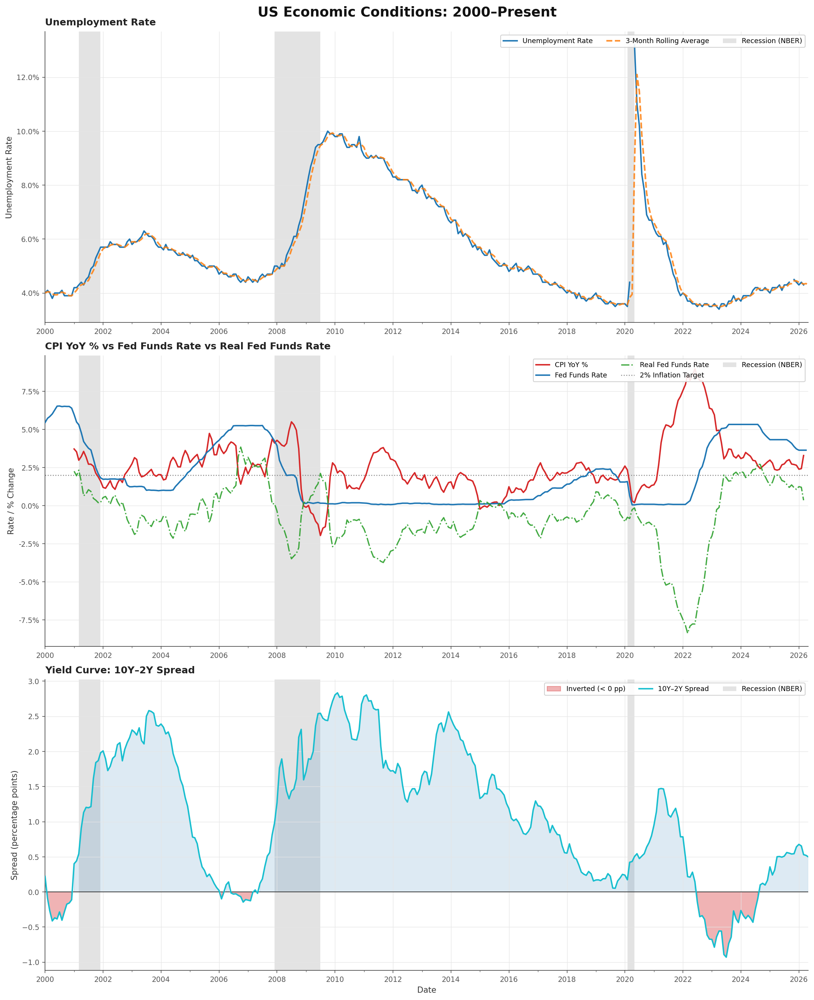

# FRED Economic Data Pipeline

A production-grade ELT pipeline that ingests macroeconomic time series data from the Federal Reserve Economic Data (FRED) API, transforms it through a layered dbt model, and surfaces actionable economic indicators in a Metabase dashboard.

## The Business Problem

Economic data is publicly available but operationally messy. Government agencies like the Bureau of Labor Statistics (BLS) and Bureau of Economic Analysis (BEA) regularly revise previously published figures — sometimes months after the fact. Most pipelines overwrite historical values when this happens, silently corrupting the record.

At the same time, economic indicators don't live in isolation. Unemployment, inflation, monetary policy, and yield curve dynamics are deeply interconnected — but they arrive at different frequencies (daily, monthly, quarterly) from different sources, making unified analysis difficult without deliberate engineering.

This pipeline solves both problems: it tracks data revisions explicitly, aligns cross-frequency series into a single analytical layer, and delivers a clean, trusted dataset for economic monitoring and decision support.

## What This Pipeline Produces

A single mart table — `fct_economic_dashboard` — containing one row per month with all key macroeconomic indicators aligned, enriched, and ready for consumption:

- **Labor market:** Unemployment rate, nonfarm payrolls, job openings, labor market tightness
- **Inflation:** CPI, PCE, core CPI, year-over-year acceleration/deceleration
- **Monetary policy:** Federal funds rate, real fed funds rate, M2 money supply
- **Yield curve:** 10Y and 2Y treasury rates, spread, inversion flag
- **Business cycle:** Recession classification, business cycle phase, economic health score
- **Trend signals:** 3-month moving averages, year-over-year deltas, directional trend labels

This output is designed for direct consumption by Metabase dashboards, analytical notebooks, or downstream ML models.

## Dashboard & Visualizations

The notebook [`notebooks/economic_story.ipynb`](notebooks/economic_story.ipynb) generates a publication-quality three-panel chart of US macroeconomic conditions from 2000 to the present, pulling directly from `public_marts.fct_economic_dashboard`. NBER recession periods are shaded on all panels.



**Panel 1 — Unemployment Rate** with 3-month rolling average overlay.  
**Panel 2 — CPI YoY % vs Fed Funds Rate vs Real Fed Funds Rate** with a 2% inflation target reference line.  
**Panel 3 — 10Y–2Y Yield Curve Spread** with red fill when inverted (below zero).

## Why This Project Exists

The Federal Reserve Bank of St. Louis maintains FRED — one of the most widely used economic databases in the world. The engineering challenges this pipeline addresses mirror the real problems that FRED's data engineering team solves at scale:

- Ingesting from multiple government statistical agencies on irregular release schedules
- Preserving historical revision vintages rather than overwriting prior values
- Detecting anomalous data before it reaches analysts
- Building reliable, tested, documented pipelines that others can maintain

This project was built to demonstrate production data engineering fundamentals applied to a domain where data quality has real-world consequences.

## What This Could Be Used For

**Economic monitoring dashboards** — Track real-time macroeconomic conditions for research teams, journalists, policy analysts, or investment professionals who need a clean, unified view of the US economy.

**Recession early warning** — The yield curve inversion flag and business cycle classification provide leading indicators that historically precede economic contractions. A team could extend this pipeline to trigger alerts when inversion thresholds are crossed.

**Monetary policy analysis** — The real fed funds rate calculation (nominal rate minus inflation) gives a clearer picture of how restrictive or accommodative Fed policy actually is — a key input for portfolio strategy and credit risk modeling.

**Academic and policy research** — Clean, revision-tracked economic time series are foundational to econometric research. This pipeline provides a reproducible, version-controlled alternative to manual data pulls.

**Feature store for ML models** — The mart layer can serve as a feature store for machine learning models that predict economic outcomes — credit defaults, housing prices, employment trends — where macroeconomic conditions are important explanatory variables.

**Eighth Federal Reserve District monitoring** — The pipeline includes Missouri-specific series (MOURN, MOSTHPI) allowing regional economic analysis specific to the St. Louis Fed's coverage area.

## Architecture

```
FRED Public API (BLS, BEA, Treasury, Federal Reserve, Census)
│
▼
┌──────────────────┐
│   Ingestion      │  FREDLoader — retry logic, schema validation,
│   (Python)       │  rate limiting, revision detection via SHA-256
└──────┬───────────┘
       │ Parquet → PostgreSQL
       ▼
┌──────────────────┐
│   Transform      │  SeriesCleaner — deduplication, anomaly flagging,
│   (Python)       │  gap detection, derived metrics
└──────┬───────────┘
       │
       ▼
┌──────────────────────────────────────┐
│   Warehouse (PostgreSQL)             │
│   public schema — fred series data   │
└──────┬───────────────────────────────┘
       │
       ▼
┌──────────────────────────────────────┐
│   dbt Transformation                 │
│   staging → intermediate → marts    │
└──────┬───────────────────────────────┘
       │
       ▼
┌──────────────────┐
│   Metabase       │  Economic dashboard — yield curve, recession
│   Dashboard      │  indicators, inflation trends, labor market
└──────────────────┘
```

## Tech Stack

| Layer      | Tool            | Purpose                                        |
|------------|-----------------|------------------------------------------------|
| Ingestion  | Python 3.12     | API fetching, validation, revision tracking    |
| Storage    | PostgreSQL      | Local warehouse, revision history              |
| Transform  | dbt Core        | Layered SQL models, data quality tests         |
| BI         | Metabase        | Dashboard and visualization (localhost:3000)   |
| Testing    | pytest          | Unit tests for ingestion and transform layers  |
| Linting    | ruff            | Code quality                                   |

## Getting Started

### Prerequisites

- Python >= 3.12
- PostgreSQL 16 (local install, not Docker)
- Docker (for Metabase only)
- `pip install -r requirements.txt`

Register for a free FRED API key at: https://fred.stlouisfed.org/docs/api/api_key.html

### Setup

```bash
# Copy environment file and add your API key
cp .env.example .env

# Start PostgreSQL on port 5433 and create the database
pg_ctl -D /usr/local/var/postgresql@16 start
psql postgres -c "CREATE USER fred_user WITH PASSWORD 'fred_pass';"
psql postgres -c "CREATE DATABASE fred_pipeline OWNER fred_user;"

# Start Metabase (Docker)
docker run -d -p 3000:3000 --name metabase metabase/metabase

# Run the full pipeline
make all
```

### Connect Metabase

Once Metabase is running, open http://localhost:3000 and connect to PostgreSQL:

- **Host:** host.docker.internal
- **Port:** 5433
- **Database:** fred_pipeline
- **Username:** fred_user
- **Password:** fred_pass

The primary table to explore is `public_marts.fct_economic_dashboard`.

### Run Individually

```bash
make ingest        # Fetch all FRED series
make clean-data    # Clean and validate
make load          # Load cleaned data into Postgres
make transform     # Run dbt models
make test          # Run pytest suite
make docs          # Generate and serve dbt docs
```

## Project Structure

```
fred-economic-pipeline/
├── ingestion/
│   ├── __init__.py
│   └── fred_loader.py        # FREDLoader class
├── transforms/
│   ├── __init__.py
│   └── series_cleaner.py     # SeriesCleaner class
├── scripts/                  # Utility and helper scripts
├── notebooks/
│   └── economic_story.ipynb  # US macroeconomic conditions visualization
├── images/
│   └── economic_story.png    # Generated chart output
├── dbt_project/
│   ├── models/
│   │   ├── staging/          # stg_fred_series.sql
│   │   ├── intermediate/     # int_macro_indicators.sql
│   │   └── marts/            # fct_economic_dashboard.sql
│   ├── tests/
│   └── dbt_project.yml
├── tests/
│   ├── test_fred_loader.py
│   └── test_series_cleaner.py
├── .env.example
├── Makefile
├── requirements.txt
└── README.md
```

## Economic Series Tracked

| Series ID | Description                  | Frequency | Category   |
|-----------|------------------------------|-----------|------------|
| UNRATE    | Unemployment Rate            | Monthly   | Labor      |
| PAYEMS    | Nonfarm Payrolls             | Monthly   | Labor      |
| JTSJOL    | Job Openings                 | Monthly   | Labor      |
| CPIAUCSL  | Consumer Price Index         | Monthly   | Inflation  |
| PCEPI     | PCE Price Index              | Monthly   | Inflation  |
| CPILFESL  | Core CPI ex Food & Energy    | Monthly   | Inflation  |
| GDP       | Gross Domestic Product       | Quarterly | Output     |
| GDPC1     | Real GDP                     | Quarterly | Output     |
| FEDFUNDS  | Federal Funds Rate           | Monthly   | Monetary   |
| M2SL      | M2 Money Supply              | Monthly   | Monetary   |
| DGS10     | 10-Year Treasury             | Daily     | Yield Curve|
| DGS2      | 2-Year Treasury              | Daily     | Yield Curve|
| T10Y2Y    | 10Y-2Y Spread                | Daily     | Yield Curve|
| MOURN     | Missouri Unemployment        | Monthly   | Regional   |
| MOSTHPI   | Missouri House Price Index   | Quarterly | Regional   |

## Areas for Production Improvement

This project demonstrates core data engineering fundamentals. A production deployment at an organization like the Federal Reserve would extend this in several meaningful ways:

1. **Direct agency feed ingestion** — Rather than the public FRED API, a production system would ingest directly from BLS, BEA, and Census FTP drops and proprietary data feeds — eliminating the API intermediary and enabling ingestion the moment data is published.

2. **Full vintage database** — The current pipeline detects revisions via hash comparison. A production system would maintain a complete realtime database — storing every historical state of every series so analysts can reconstruct what the data looked like on any given date.

3. **Release calendar monitoring** — Production pipelines need to know when to expect data and alert when a release is late. A release calendar monitor would track expected publication dates for each agency and trigger alerts if data doesn't arrive on schedule.

4. **Proper orchestration** — A production system would use Airflow or Prefect to schedule ingestion runs, manage dependencies between tasks, and handle failures with alerting and automatic retries.

5. **Cloud warehouse at scale** — PostgreSQL works for development but a production deployment would use Snowflake, BigQuery, or Redshift with proper partitioning, clustering, and query optimization for high concurrency.

6. **Streaming ingestion** — Some indicators (treasury yields, equity indices) update continuously. A production system would publish release events to a Kafka topic and trigger pipeline runs in real time rather than on a batch schedule.

7. **Data quality monitoring** — Beyond pytest and dbt tests, a production system would use Great Expectations or Monte Carlo for continuous data quality monitoring — tracking statistical distributions over time and alerting when metrics drift outside expected bounds.

8. **Row-level access controls** — A production warehouse would implement row-level security so external researchers, internal analysts, and public API consumers see only the data they're authorized for.

## About FRED

The Federal Reserve Bank of St. Louis maintains FRED — one of the most widely used economic databases in the world, with over 800,000 data series from 100+ sources. This project is built on their public API and is not affiliated with or endorsed by the Federal Reserve System.